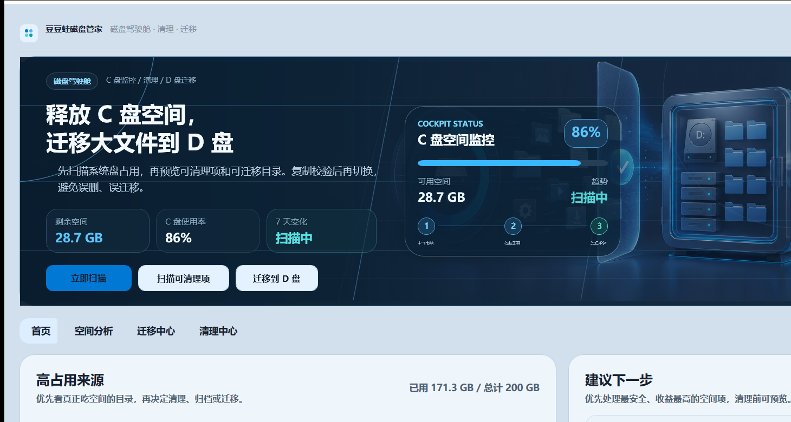

# 盘管家（PanGuardian）

一个面向 Windows 本地环境的 C 盘空间治理工具，帮助用户定位空间占用、安全清理可回收数据，并将微信、企业微信和桌面等高增长目录迁移到其他磁盘。

> 当前为功能原型。执行清理或目录迁移前，请先备份重要数据。



## 已实现

- `C# + .NET 8 + WPF` 桌面界面和分层项目结构
- Windows 系统盘、微信、企业微信、桌面、下载和临时目录扫描
- 大文件与增长来源展示
- 清理候选扫描，删除操作默认进入回收站
- 微信 / 企业微信目录迁移、目录联接切换和回滚流程
- 迁移前置检查、记录与恢复点

## 文档

- [产品方案](docs/PRODUCT_SPEC.md)
- [页面原型与交互流程](docs/UI_FLOW.md)
- [技术架构与项目骨架](docs/TECH_ARCHITECTURE.md)

## 环境要求

- Windows 10 或 Windows 11
- [.NET 8 SDK](https://dotnet.microsoft.com/download/dotnet/8.0)
- Visual Studio 2022（可选，需安装“.NET 桌面开发”工作负载）

## 本地构建与运行

```powershell
dotnet build .\PanGuardian.sln
dotnet run --project .\src\PanGuardian.App\PanGuardian.App.csproj
```

部分系统临时目录和目录联接操作可能需要管理员权限。

## 日常更新到 GitHub

在仓库目录中执行：

```powershell
.\Update-GitHub.ps1 -Message "说明这次改了什么"
```

脚本会依次提交本地修改、同步远端更新并推送到 GitHub。建议一次提交只处理一个明确事项，提交说明写清“改了什么”；不要把密码、密钥、个人数据和编译产物加入仓库。

## 下一步

- 增加自动化测试和持续集成
- 补充 SQLite 扫描快照与历史趋势
- 完善定时巡查和增长预警
- 增加安装包与版本发布流程
