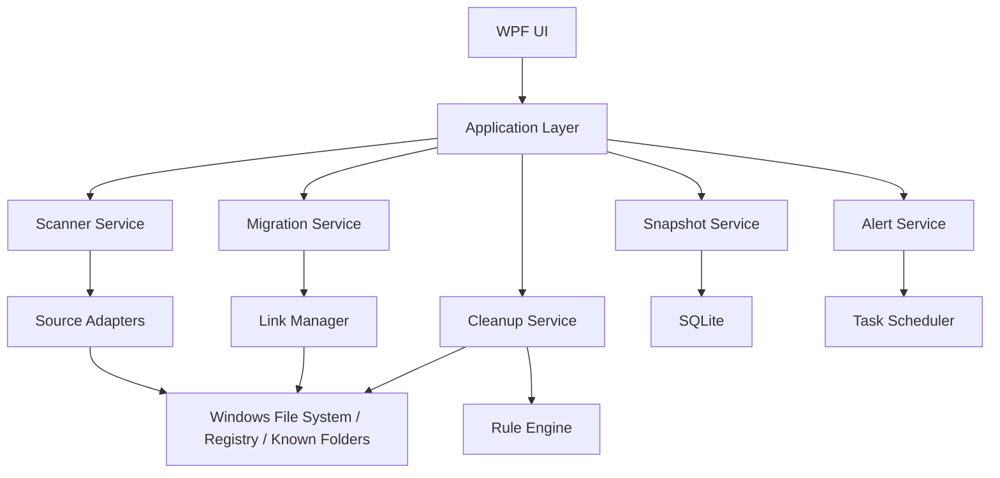

# 技术架构与项目骨架

## 1. 技术选型

推荐第一版采用：

- UI：`WPF`
- 语言：`C# / .NET 8`
- 本地数据库：`SQLite`
- 定时任务：`Windows Task Scheduler`
- 打包方式：`MSIX` 或独立安装包

选择这套方案的原因：

- 对 Windows 文件系统、权限、系统 API 兼容性更好
- GUI 开发效率高，适合做本地工具
- 便于后续接入托盘、管理员权限、任务计划、Shell 操作

## 2. 总体架构



## 3. 模块划分

### 3.1 UI 层

建议采用 MVVM：

- `Views`
  - DashboardView
  - AnalysisView
  - CleanupView
  - AppDataView
  - DesktopArchiveView
  - HistoryView
  - SettingsView
- `ViewModels`
  - DashboardViewModel
  - ScanResultViewModel
  - CleanupTaskViewModel
  - MigrationWizardViewModel
  - TrendViewModel
  - SettingsViewModel

### 3.2 应用层

负责组织业务流程：

- `ScanOrchestrator`
- `CleanupOrchestrator`
- `MigrationOrchestrator`
- `AlertOrchestrator`
- `SettingsOrchestrator`

### 3.3 领域服务

- `ScannerService`
  - 扫描目录大小
  - 扫描文件分布
  - 统计增长
- `ClassificationService`
  - 路径分类
  - 文件类型分类
  - 来源分类
- `CleanupService`
  - 执行安全清理
  - 输出清理报告
- `MigrationService`
  - 复制目录
  - 完整性校验
  - 建立目录联接
  - 失败回滚
- `SnapshotService`
  - 存储扫描快照
  - 计算差异
- `AlertService`
  - 阈值检查
  - 通知触发

### 3.4 适配器层

对不同空间来源做专项识别：

- `WeChatAdapter`
- `WeComAdapter`
- `DesktopAdapter`
- `WindowsCacheAdapter`
- `BrowserCacheAdapter`

每个 Adapter 输出统一结构：

- 来源名称
- 目录列表
- 分类结果
- 风险等级
- 推荐动作

## 4. 微信 / 企业微信迁移设计

### 4.1 迁移原则

- 优先使用应用官方支持的存储位置配置
- 若应用不支持，则使用“复制 + 校验 + 目录联接 + 验证 + 回滚”
- 默认不自动迁移聊天记录数据库

### 4.2 目录处理策略

| 目录类型 | 默认动作 | 说明 |
|---|---|---|
| 聊天数据库 | 禁止自动处理 | 高风险，默认只展示 |
| 媒体/附件 | 允许迁移 | 迁移到 D 盘优先 |
| 缓存/临时文件 | 允许清理或迁移 | 清理优先 |
| 日志/崩溃文件 | 允许清理 | 可直接释放空间 |

### 4.3 迁移流程

1. 检查目标盘为 NTFS，空间是否足够
2. 检查微信或企业微信是否仍在运行
3. 锁定待迁移目录清单
4. 复制到目标路径
5. 逐文件校验大小、数量和关键哈希
6. 备份原路径元信息
7. 重命名原目录为备份目录
8. 创建目录联接
9. 启动应用并做基本存活验证
10. 成功后保留回滚点一段时间

### 4.4 联接策略

优先使用目录联接（junction）而不是要求用户手工维护路径。

原因：

- 对大多数 Windows 应用透明
- 不改变用户使用习惯
- 迁移后原路径仍可继续访问

## 5. 扫描与快照设计

### 5.1 扫描类型

- `深度扫描`
  - 首次运行或用户主动触发
  - 枚举更多目录和文件信息
- `快速扫描`
  - 定时巡查
  - 只看重点来源和历史高增长区域

### 5.2 快照粒度

建议保存：

- 扫描时间
- 盘符总空间 / 可用空间
- 目录级占用
- 来源级占用
- 大文件清单
- 风险建议

### 5.3 增长分析

基于相邻快照计算：

- 目录增长量
- 应用来源增长量
- 文件类型增长量
- 新增大文件

## 6. 数据库设计

建议使用 SQLite，核心表如下：

### `scan_snapshot`

- `id`
- `scan_type`
- `drive_name`
- `total_bytes`
- `free_bytes`
- `created_at`

### `space_item`

- `id`
- `snapshot_id`
- `item_type`
- `source_name`
- `path`
- `size_bytes`
- `growth_bytes`
- `risk_level`
- `recommended_action`

### `large_file`

- `id`
- `snapshot_id`
- `path`
- `size_bytes`
- `extension`
- `last_modified_at`

### `cleanup_record`

- `id`
- `task_type`
- `target_path`
- `released_bytes`
- `status`
- `created_at`

### `migration_record`

- `id`
- `app_name`
- `source_path`
- `target_path`
- `link_type`
- `status`
- `rollback_path`
- `created_at`

### `alert_rule`

- `id`
- `rule_type`
- `threshold_value`
- `is_enabled`

### `alert_record`

- `id`
- `rule_id`
- `message`
- `severity`
- `created_at`

## 7. 风险控制

### 7.1 执行前

- 检测管理员权限
- 检测目标盘剩余空间
- 检测目标分区文件系统
- 检测应用运行状态
- 检测是否已存在联接或历史迁移记录

### 7.2 执行中

- 所有高风险动作先 dry-run 预演
- 大文件操作显示进度和可取消状态
- 所有删除操作默认优先回收站

### 7.3 执行后

- 输出操作报告
- 保留回滚入口
- 异常时自动恢复原状态

## 8. 项目目录建议

```text
PanGuardian/
├─ src/
│  ├─ PanGuardian.App/                # WPF 启动项目
│  ├─ PanGuardian.Application/        # 编排层
│  ├─ PanGuardian.Domain/             # 实体、枚举、接口
│  ├─ PanGuardian.Infrastructure/     # SQLite、文件系统、系统API
│  ├─ PanGuardian.Adapters/           # 微信/企微/桌面/缓存适配器
│  ├─ PanGuardian.Contracts/          # DTO 和共享模型
│  └─ PanGuardian.Tests/              # 单元测试与集成测试
├─ docs/
├─ tools/
│  ├─ sample-data/
│  └─ migration-sandbox/
└─ installer/
```

## 9. 推荐的核心类

- `DriveSummary`
- `SpaceItem`
- `LargeFileItem`
- `CleanupCandidate`
- `MigrationCandidate`
- `MigrationPlan`
- `MigrationResult`
- `AlertRule`
- `AlertResult`

关键接口建议：

- `IScannerService`
- `IClassificationService`
- `ICleanupService`
- `IMigrationService`
- `ISnapshotRepository`
- `IAlertService`
- `ISourceAdapter`

## 10. 开发顺序建议

### 第 1 阶段：先把看见问题做出来

- 扫描器
- 快照存储
- 首页总览
- 占用排行
- 大文件列表

### 第 2 阶段：把安全清理做完整

- A 类安全项清理
- 清理报告
- 高风险确认机制

### 第 3 阶段：攻克微信 / 企业微信迁移

- 专项适配器
- 迁移向导
- 校验与回滚
- 目录联接

### 第 4 阶段：补长期治理能力

- 定时巡查
- 趋势图
- 异常增长告警
- 托盘提醒

## 11. 后续可扩展点

- 浏览器下载目录专项治理
- OneDrive / 企业同步盘专项分析
- 开发环境缓存专项清理
- 配置导出导入
- 诊断包导出给同事复用
