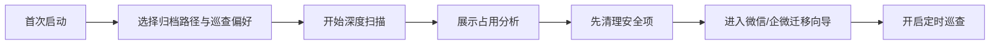
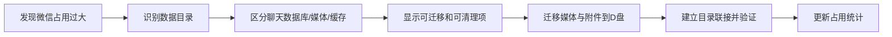
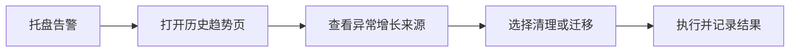

# 页面原型与交互流程

## 1. 信息架构

```text
盘管家
├─ 首页总览
├─ 空间分析
├─ 清理中心
├─ 微信与企业微信
├─ 桌面归档
├─ 历史趋势
└─ 设置与巡查
```

## 2. 首页总览

目标：让用户 10 秒内看清“C 盘现在怎么样，要先做什么”。

### 页面结构

```text
+--------------------------------------------------------------+
| 盘管家                                       [立即扫描] [设置] |
+--------------------------------------------------------------+
| C盘剩余: 28 GB   已用: 86%   最近7天增长: +12.4 GB            |
+----------------------+----------------------+------------------+
| 主要占用来源         | 风险提示             | 推荐动作         |
| 1. 微信      24 GB   | 桌面新增 8 个大文件  | 清理安全项       |
| 2. 桌面      18 GB   | 企微缓存增长 6 GB    | 迁移微信媒体     |
| 3. 系统缓存   9 GB   | 剩余空间低于阈值     | 归档桌面大文件   |
+--------------------------------------------------------------+
| 近30天趋势图                                                |
+--------------------------------------------------------------+
| 最近扫描发现                                                |
| - 可安全清理: 6.8 GB                                        |
| - 建议迁移: 31.2 GB                                          |
| - 需要人工确认: 9.4 GB                                       |
+--------------------------------------------------------------+
```

### 核心操作

- `立即扫描`
- `清理安全项`
- `查看大文件`
- `打开微信/企微搬家`
- `开启巡查`

## 3. 空间分析页

目标：回答“到底是谁占用了 C 盘”。

### 页面布局

- 左侧：目录树和来源分类
- 右侧：详情面板和操作建议

### 主要视图

- 按目录排行
- 按应用来源排行
- 按文件类型排行
- 按增长速度排行
- Top 大文件列表

### 列表字段

- 路径
- 当前大小
- 最近 7 天增长
- 风险等级
- 建议动作

## 4. 清理中心

目标：把“能安全清的”集中管理。

### 模块卡片

- 临时文件
- 回收站
- 浏览器缓存
- 缩略图缓存
- 日志与转储
- Windows 更新残留

### 交互要求

- 默认全部先计算可释放空间
- 每项都展示：
  - 可释放容量
  - 风险等级
  - 清理说明
  - 上次清理时间
- 高风险项必须二次确认

## 5. 微信与企业微信页

目标：把用户最关心的占用点做成专门入口。

### 页面结构

```text
+--------------------------------------------------------------+
| 微信与企业微信                                               |
+----------------------+---------------------------------------+
| 应用列表             | 详情                                  |
| - 微信               | 当前总占用: 24 GB                     |
| - 企业微信           | 聊天记录数据库: 8 GB (禁止自动处理)   |
|                      | 图片/视频/附件: 13 GB (可迁移)        |
|                      | 缓存与日志: 3 GB (可清理)             |
|                      |                                       |
|                      | [迁移到D盘] [清理缓存] [查看路径]     |
+--------------------------------------------------------------+
```

### 迁移向导流程

1. 检测应用是否运行
2. 提示关闭微信/企业微信
3. 展示可迁移目录与不可动目录
4. 选择目标路径，例如 `D:\AppData\WeChat`
5. 执行复制与完整性校验
6. 建立目录联接
7. 启动应用验证
8. 显示成功结果或回滚选项

### 关键交互原则

- 明确标出“不碰聊天记录”
- 每一步都告诉用户在做什么
- 出问题时优先恢复原状态

## 6. 桌面归档页

目标：让桌面不再成为隐形大仓库。

### 页面布局

- 文件列表
- 类型筛选
- 日期筛选
- 推荐归档路径

### 推荐动作

- 按月归档
- 按类型归档
- 一键移动大文件
- 忽略白名单

## 7. 历史趋势页

目标：回答“为什么越用越大”。

### 核心图表

- C 盘使用量趋势
- 按来源增长曲线
- 微信/企业微信增长曲线
- 桌面文件增长曲线

### 关键列表

- 最近 7 天新增最多目录
- 最近 30 天增长最快应用
- 最近触发的告警记录

## 8. 设置与巡查页

### 可配置项

- 每日快扫时间
- 每周深扫时间
- 空间不足阈值
- 单目录异常增长阈值
- 默认归档路径
- 白名单路径
- 管理员权限检查

### 可选通知

- 应用内提醒
- 托盘气泡提醒

## 9. 关键用户流程

### 流程 A：首次深扫



### 流程 B：处理微信空间过大



### 流程 C：收到空间预警



## 10. 设计重点

- 首页必须直接给出建议动作，而不是只展示数据
- 微信和企业微信必须是独立入口，减少用户心理负担
- 高风险动作不隐藏，但一定要解释清楚
- 趋势图必须可读，重点突出“最近是谁涨了”
